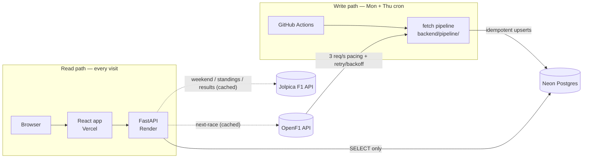

# F1 Tracker

Personal skill-building project: real F1 lap-timing data, pulled on a schedule,
persisted to Postgres, and served through a deployed dashboard — built to
practice REST API integration, retry/backoff handling, idempotent database
upserts, structured logging, CI scheduling, and a full-stack deploy.

**Live:** frontend on Vercel, API on Render, database on Neon. Data lands
twice a week via GitHub Actions.

## What it does

Pulls lap-by-lap timing data for every driver across four teams (Ferrari,
Mercedes, McLaren, Red Bull) from the [OpenF1 API](https://openf1.org/) for
each completed race weekend, persists it to Postgres, and serves it through a
read-only dashboard: lap-time trends, teammate delta, tire strategy, pit
stops, track position, weather, and the race-control feed — plus
Jolpica-backed Race Weekend and Standings pages — for a head-to-head
comparison between any two drivers on the tracked teams.

## Architecture

Two loosely-coupled halves that only meet at the database — the **write
path** (scheduled pipeline) and the **read path** (dashboard):



Key properties, each explained fully in
[docs/DESIGN-DECISIONS.md](docs/DESIGN-DECISIONS.md):

- **The API never calls OpenF1 for telemetry** — it serves what the pipeline
  already persisted, so it's immune to rate limits and OpenF1's live-session
  lockout. The three dashed exceptions above (next-race countdown, race
  weekend, standings/results) each sit behind a disk-persisted cache and
  degrade to stale data or `null`, never a 5xx.
- **Reruns are free** — every table upserts on its natural key
  (`ON CONFLICT ... DO UPDATE`), so the Thursday redundancy run is a no-op
  when Monday worked and a recovery when it didn't.
- **Two external APIs on purpose** — OpenF1 is a session-timing API with no
  concept of schedules or standings; the free
  [Jolpica F1 API](https://github.com/jolpica/jolpica-f1) (Ergast-schema)
  covers exactly that.
- **The API defends itself and its upstreams** — per-client rate limiting
  (120 req/min sliding window), GET-only CORS, gzip, and
  `Cache-Control` on the immutable per-race endpoints.

## Project structure

All Python lives under `backend/`, mirroring `frontend/`. Every command runs
from the repo root (that's where `venv/` and `.env` live), using
`py -m backend.<package>.<module>` so the `backend.*` imports resolve.

- **`backend/api/`** — read-only FastAPI layer over Postgres. Rate limiting,
  CORS, gzip, per-endpoint caching.
- **`backend/pipeline/`** — the scheduled fetch job: `fetch_laps.py` (domain
  logic: which session, which drivers, what to fetch), `backfill.py` (same
  pipeline over every completed race of a season), `store.py` (the write
  path: one idempotent upsert per table).
- **`backend/shared/`** — code both sides import: `openf1_client.py` /
  `jolpica_client.py` (transport: pacing, retry/backoff),
  `openf1_endpoints.py` (one thin wrapper per endpoint), `db.py`,
  `logger.py`, `next_race.py`, `jolpica_lookup.py` / `jolpica_results.py` /
  `race_weekend.py` (schedule, standings, official results),
  `circuit_facts.json` (hand-curated circuit card data).
- **`backend/schema.sql`** — 7 tables: `races` and `drivers` as hubs;
  `laps`, `stints`, `pit`, `weather`, `positions` on composite natural keys;
  `race_control` insert-only.
- **`frontend/`** — Vite + React + TypeScript dashboard: scroll-spy navbar
  (Overview / Race Weekend / Standings / Race Analysis / About), Recharts
  for 2D charts, react-three-fiber for the 3D hero, Framer Motion for
  transitions. A team switcher retints the whole page — charts included —
  to any head-to-head pair's validated colors.
- **`dev.ps1`** — starts API + frontend, one terminal window each.
- **`DEPLOYMENT.md`** — the Vercel + Render deploy runbook (env vars, CORS,
  health checks).
- **`docs/DESIGN-DECISIONS.md`** — the full design-decision log and known
  data quirks.

## Status

- [x] **part 1** — fetch-only script, no DB. Pulls and prints lap data from
      the latest completed race session.
- [x] **part 2** — retry/backoff for the API's 3 req/sec rate limit, proper
      exception handling (retryable vs. non-retryable), proactive pacing.
- [x] **part 3** — Postgres via Docker Compose. Schema for
      races/drivers/laps. Idempotent upserts. Credentials in `.env`.
- [x] **part 4** — structured logging via the `logging` module instead of
      print statements.
- [x] **part 5** — GitHub Actions scheduling (Monday + Thursday), migration
      to managed cloud Postgres (Neon), schema expansion (stints, pit stops,
      weather, positions, race control).
- [x] **part 6** — the dashboard: a FastAPI JSON layer plus a React
      frontend, through several iterations — full visual redesign ("liquid
      glass" surfaces, scroll-spy navbar), 4-team pair switcher with
      validated palettes, performance pass (code-splitting, caching, a
      scroll-jank fix), app-wide Jolpica integration (Race Weekend +
      Standings), a security-hardening pass — **deployed to Vercel + Render**
      (see [DEPLOYMENT.md](DEPLOYMENT.md)).

This is a skill-building project, not a finished product.

## Running it locally

### The dashboard

One command, from the repo root:

```powershell
.\dev.ps1
```

That opens two terminal windows — the API on http://localhost:8000 and the
frontend on http://localhost:5173 — then open http://localhost:5173. To
restart either one: close its window and rerun `.\dev.ps1` (the API runs
with `--reload`, so most backend edits pick up automatically).

The raw commands, if you'd rather run them yourself (both from the repo
root; first-time installs commented):

```powershell
# .\venv\Scripts\python.exe -m pip install -r backend\api\requirements.txt
.\venv\Scripts\python.exe -m uvicorn backend.api.main:app --reload --reload-dir backend
```

```powershell
cd frontend
# npm install
npm run dev
```

The frontend expects the API on `http://localhost:8000` (override with
`VITE_API_URL`, see `frontend/.env.example`); the API's CORS only allows the
frontend on port 5173 — if Vite picks another port, some other dev server is
already running. First load after the database has been idle can take a few
seconds — Neon's free tier scales to zero and cold-starts on the first
connection.

### The fetch pipeline (what the GitHub Actions cron runs)

```powershell
.\venv\Scripts\python.exe -m backend.pipeline.fetch_laps    # latest completed race
.\venv\Scripts\python.exe -m backend.pipeline.backfill      # every completed race this season
```

## Local development setup

**Virtual environment.** All Python dependencies live in the repo's private
`venv/` instead of the global interpreter, so this project's package
versions can't collide with any other project's. Activate with
`.\venv\Scripts\Activate.ps1` — the prompt shows `(venv)` when it worked.
(Windows: use `py`, not `python`, to avoid the Windows Store alias.)

**Local Postgres (optional — production uses Neon).** Copy `.env.example`
to `.env` (gitignored, never committed), then:

```bash
docker compose up -d
```

Apply the schema once:

```powershell
Get-Content backend\schema.sql -Raw | docker exec -i f1_tracker_db psql -U f1user -d f1tracker
```

(PowerShell reserves the `<` redirection operator — piping via `Get-Content`
is the workaround; Git Bash supports `<` natively.) Postgres always listens
on 5432 *inside* the container; the host-side port is the left half of the
`"5432:5432"` mapping in `docker-compose.yml` and is yours to change if 5432
is taken.

## Stack

- Python + `requests` — OpenF1 and Jolpica API clients (`backend/shared/`)
- `psycopg2` + Postgres — persistence (`backend/pipeline/store.py`, `backend/schema.sql`)
- Neon — managed Postgres, reachable by scheduled cloud runs
- GitHub Actions — twice-weekly fetch schedule (SHA-pinned actions, read-only token)
- FastAPI + uvicorn — read-only JSON API with rate limiting, gzip, and
  cached live passthroughs (`backend/api/`), deployed on Render
- Vite + React + TypeScript — dashboard frontend (`frontend/`), deployed on
  Vercel with CSP/security headers (`frontend/vercel.json`)
- Recharts (2D charts) · react-three-fiber/three.js (3D hero) · Framer Motion (transitions)
